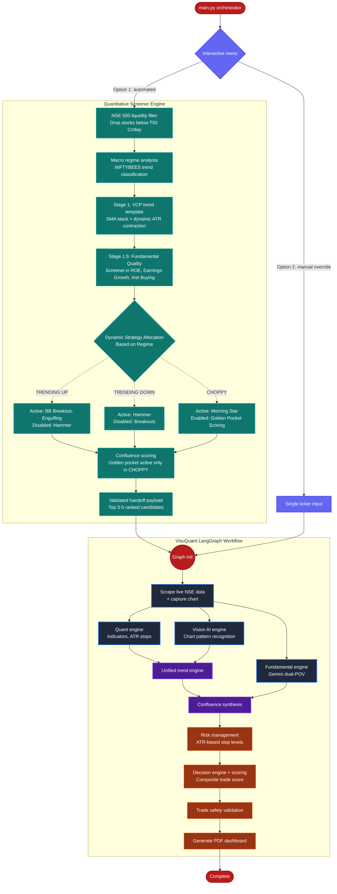

# FinVison Tech Analysis 

An **Quantitative & Vision-Driven Technical Analysis Pipeline**.

FinVison acts as a fully autonomous algorithmic analyst. It fetches live market data, captures chart screenshots, calculates rigorous quantitative indicators, runs multimodal AI (Vision + NLP) for complex pattern recognition, and orchestrates everything into a beautiful, professional PDF dashboard using **LangGraph**.

---

##  Architecture & Pipeline Flow

The system is built on a directed acyclic graph (DAG) state machine using **LangGraph**. Data flows linearly from market scraping to the final PDF generation.



---

##  Project Structure & Key Modules

VisuQuant is structured as a **Monorepo** to cleanly separate the backend quantitative engine from the frontend visual dashboard.

```text
finvison_tech_analysis/
├── Quant_backend/          <-- (Python algorithmic engine & AI orchestration)
│   ├── src/
│   ├── main.py
│   └── requirements.txt
│
└── visuquant_frontend/     <-- (Next.js web dashboard)
    ├── src/app/
    └── package.json
```

### `Quant_backend/src/workflow/` (LangGraph Orchestration)
- **`graph.py`**: Compiles the nodes into a LangGraph state machine, enforcing execution order.
- **`state.py`**: Defines the `TypedDict` schema representing the memory passed between nodes.
- **`nodes.py`**: The heart of the application containing the LLM invocation functions for Vision, Unified Trend, Confluence, and Decision generation.

### `quant/` (Mathematical & Risk Engine)
- **`quant_calculations.py`**: The mathematical engine computing Moving Averages, RSI, MACD, ADX, ATR, Bollinger Bands, and Volume/Liquidity metrics.
- **`risk_calculations.py`**: Computes entry price, optimal stop losses (using ATR logic), position sizing, and Risk/Reward targets.
- **`trade_validation.py`**: Performs institutional baseline safety checks (e.g. Absolute Liquidity > $10M ADV) and flags systemic execution risks.

### `screener/` (Vectorized Stock Screening)
The foundational quantitative filtering layer that scans the entire market (500 symbols) to find high-probability setups *before* they are sent to the Vision AI.
- **`pipeline/run_daily_screen.py`**: The orchestrator for the screener. It applies sequential filtering: Liquidity -> Stage 1 (Minervini VCP Template with dynamic ATR percentile thresholds) -> Stage 1.5 (Fundamental Quality filtering via Screener.in) -> Stage 2 (Trigger Layer for active setups like Bollinger Breakout or Engulfing). It also runs a market regime check on the NIFTY500 to dynamically tag the macro environment (Trending Up, Trending Down, or Choppy).
- **`pipeline/handoff.py`**: Packages the strictly validated signals (trigger type, composite score, regime, and quantitative metrics) into a VisuQuant payload and pipes them directly into the generative Chart Capture workflow.
- **`pipeline/backtest.py`**: Contains strict statistical significance tests, including placebo/shuffle loops and walk-forward block validation, to ensure that the alpha of any trigger logic is durable and not curve-fitted.
- **`screens/trigger_layer.py`**: The specific pattern matching logic (Bollinger Squeeze breakouts, Bullish Engulfing, MA Pullback Bounce) that accepts dynamic active/disabled rules based on the current regime playbook.
- **`indicators/core.py`**: High-performance, pure vectorized functions for SMA, EMA, ATR, Bollinger Bands, RSI, MACD, and Swing Detection using `pandas-ta` and `scipy`. Actively excludes circuit days to prevent distorted readings.
- **`screens/fundamental_quality.py`**: A robust techno-funda filter that evaluates Earnings Growth (YoY), Profitability (ROE/ROCE), and Institutional Accumulation to drop low-quality companies before technical triggers are fired.
- **`config.py`**: Holds strategy thresholds (liquidity, ATR, BB lookbacks) and the core `REGIME_STRATEGIES` dictionary that dynamically maps trigger patterns to the Bullish, Bearish, or Choppy market environments.

### `data/` (Acquisition & Fetching)
- **`nse_fetcher.py`**: Handles live market data scraping from NSE Bhavcopy and implements highly-optimized caching for massive historical lookbacks. It also exposes the `get_ohlcv` wrapper that serves clean data to the screener, automatically flagging circuit limits and corporate action gaps.
- **`screener_in_client.py`**: Uses asynchronous Playwright automation to scrape real-time financial tables (P&L, Quarters, Investors) directly from Screener.in to fuel the Stage 1.5 fundamental filter.
- **`scraper.py`**: Playwright headless browser automation to capture interactive TradingView charts as base64 images.
- **`news_fetcher.py`**: Fetches the latest corporate announcements (targeting "Outcome of Board Meeting", "Financial Results", and "Earnings Call Transcripts") from the NSE. It also aggregates the latest top 5 headlines from Google News RSS. It leverages **Gemini 3.6 Flash** (via direct REST API, with graceful degradation to 3.5-flash-lite on 429/503 errors) to strictly extract structured JSON containing **Short-Term POV** and **Long-Term POV**.

### `core/` (Foundational Utilities)
- **`llm.py`**: Standardized wrapper for LLM calls supporting fallback mechanisms (e.g. Qwen2.5-VL for vision).

### `reporting/` (PDF Generation)
- **`storage.py` & `templates/`**: Processes the final JSON outputs, injects them into HTML templates using **Jinja2**, and renders the output to a highly stylized PDF.

---

##  Technology Stack

1. **Orchestration & Workflow**:
   - `LangGraph`: Used to manage state, graph traversal, and parallel node execution.
2. **Artificial Intelligence**:
   - `Ollama`: Local LLM serving for total privacy.
   - `Qwen2.5-VL` / Vision Models: Used to "look" at the TradingView charts and interpret support, resistance, and channel patterns exactly like a human analyst would.
   - `Llama3` / `DeepSeek`: Used for deterministic reasoning inside the Decision and Confluence nodes.
   - `Gemini 3.6 Flash`: Direct REST API integration for high-context, ultra-fast structural financial data extraction from Board Meeting PDFs.
3. **Data Acquisition**:
   - `NSE Bhavcopy Scraper`: Grabs end-of-day history for Quantitative logic directly from NSE servers.
   - `Playwright`: Headless automation to capture live interactive TradingView charts.
   - `Fundamental Scraper`: Fetches real-time corporate announcements & transcripts (via PyMuPDF) and live Google News RSS feeds, routing them to Gemini for strict dual-POV structured JSON extraction.
4. **Data Science / Quantitative**:
   - `Pandas` and `NumPy` for native deterministic technical indicator math.
5. **Presentation & Reporting**:
   - `HTML5 / Vanilla CSS`: For styling the institutional report structure.
   - `Jinja2`: Templating engine to dynamically inject variables into the layout.
   - `xhtml2pdf`: Compiles the dynamic HTML into the final `outputs/` PDF dashboard.

---

##  How it Handles Logic

Unlike most AI wrappers, FinVison features strict **Mathematical Gating** to prevent LLM hallucinations:
- If the LLM generates a score for an undefined or missing chart pattern, the Python weighting engine intercepts the JSON, drops it, and dynamically normalizes the scores.
- If the directional indicators (like RSI or EMA) contradict an LLM's bullish assessment, the python Quantitative module artificially flips the multiplier on indicators like ADX (Trend Strength) to prevent logically impossible grading.
- If volume filters (ADV shares < 100k) trigger, it enforces a System Hard Stop inside the PDF.

##  Execution

To run the pipeline backend, navigate to the backend directory and execute the main orchestrator:
```bash
cd Quant_backend
python3 src/main.py
```
This will launch an interactive menu:
1. **Run automated daily screener**: Scans the market for pristine setups and dynamically generates reports for the top survivors.
2. **Analyze a specific ticker**: Bypasses the screener and runs the deep-dive pipeline on a single stock (e.g., `RELIANCE`).

The system will autonomously fetch data, analyze the chart, reason through the indicators, and dump a production-grade PDF into the `outputs/` folder!