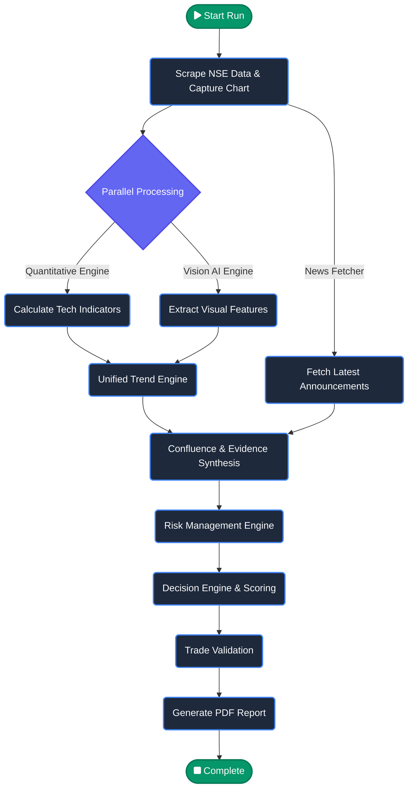

# FinVison Tech Analysis 

An **Quantitative & Vision-Driven Technical Analysis Pipeline**.

FinVison acts as a fully autonomous algorithmic analyst. It fetches live market data, captures chart screenshots, calculates rigorous quantitative indicators, runs multimodal AI (Vision + NLP) for complex pattern recognition, and orchestrates everything into a beautiful, professional PDF dashboard using **LangGraph**.

---

##  Architecture & Pipeline Flow

The system is built on a directed acyclic graph (DAG) state machine using **LangGraph**. Data flows linearly from market scraping to the final PDF generation.



---

##  Project Structure & Key Modules

The core logic resides in the `src/` directory.

- **`main.py`**: The main entry point. Automatically verifies Ollama status and triggers the pipeline.
- **`graph.py`**: Compiles the nodes into a LangGraph state machine, enforcing execution order.
- **`state.py`**: Defines the `TypedDict` schema representing the memory passed between nodes.
- **`nodes.py`**: The heart of the application containing the LLM invocation functions for Vision, Unified Trend, Confluence, and Decision generation.
- **`quant_calculations.py`**: The mathematical engine that computes Moving Averages, RSI, MACD, ADX, ATR, Bollinger Bands, and Volume/Liquidity metrics.
- **`nse_fetcher.py` / `scraper.py`**: Handles live market data scraping (NSE Bhavcopy) and TradingView chart screenshot capture via headless browser.
- **`news_fetcher.py`**: Fetches the latest corporate announcements from the NSE and uses a local LLM to perform strict extractive summarization of attached PDFs, avoiding boilerplate legal jargon.
- **`risk_calculations.py`**: Computes entry price, optimal stop losses (using ATR logic), position sizing, and Risk/Reward targets.
- **`trade_validation.py`**: Performs institutional baseline safety checks (e.g. Absolute Liquidity > $10M ADV) and flags systemic execution risks before the report prints.
- **`llm.py`**: Standardized wrapper for LLM calls supporting fallback mechanisms (e.g. Qwen2.5-VL for vision).
- **`storage.py` & `templates/`**: Processes the final JSON outputs, injects them into HTML templates using **Jinja2**, and renders the output to a highly stylized PDF.

---

##  Technology Stack

1. **Orchestration & Workflow**:
   - `LangGraph`: Used to manage state, graph traversal, and parallel node execution.
2. **Artificial Intelligence**:
   - `Ollama`: Local LLM serving for total privacy.
   - `Qwen2.5-VL` / Vision Models: Used to "look" at the TradingView charts and interpret support, resistance, and channel patterns exactly like a human analyst would.
   - `Llama3` / `DeepSeek`: Used for deterministic reasoning inside the Decision and Confluence nodes.
3. **Data Acquisition**:
   - `NSE Bhavcopy Scraper`: Grabs end-of-day history for Quantitative logic directly from NSE servers.
   - `Playwright`: Headless automation to capture live interactive TradingView charts.
   - `Fundamental Scraper`: Fetches real-time corporate announcements and extracts text from attached PDFs (via PyMuPDF).
4. **Data Science / Quantitative**:
   - `Pandas` and `NumPy` for native deterministic technical indicator math.
5. **Presentation & Reporting**:
   - `HTML5 / Vanilla CSS`: For styling the institutional report structure.
   - `Jinja2`: Templating engine to dynamically inject variables into the layout.
   - `xhtml2pdf`: Compiles the dynamic HTML into the final `outputs/` PDF dashboard.

---

##  How it Handles Logic

Unlike most AI wrappers, FinVison features strict **Mathematical Gating** to prevent LLM hallucinations:
- If the LLM generates a score for an undefined or missing chart pattern, the Python weighting engine intercepts the JSON, drops it, and dynamically normalizes the scores.
- If the directional indicators (like RSI or EMA) contradict an LLM's bullish assessment, the python Quantitative module artificially flips the multiplier on indicators like ADX (Trend Strength) to prevent logically impossible grading.
- If volume filters (ADV shares < 100k) trigger, it enforces a System Hard Stop inside the PDF.

##  Execution

To run the pipeline on a ticker (e.g., `CARTRADE`):
```bash
python3 src/main.py CARTRADE
```
This will autonomously fetch data, analyze the chart, reason through the indicators, and dump a production-grade PDF into the `outputs/` folder!
